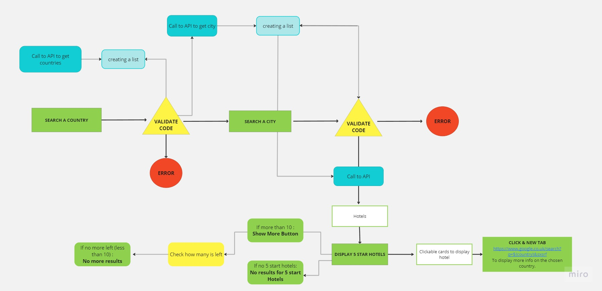
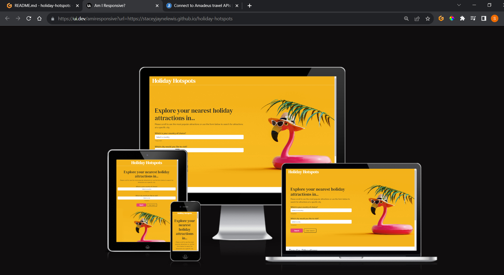
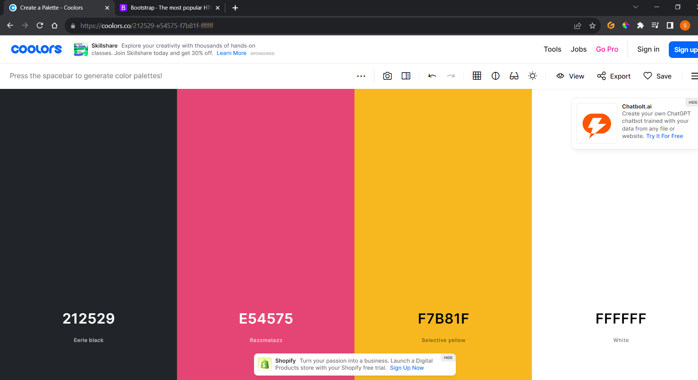
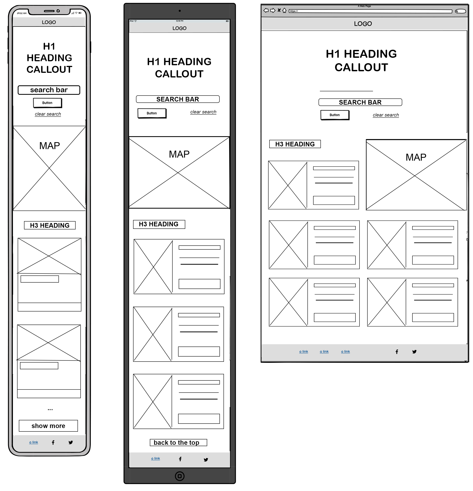
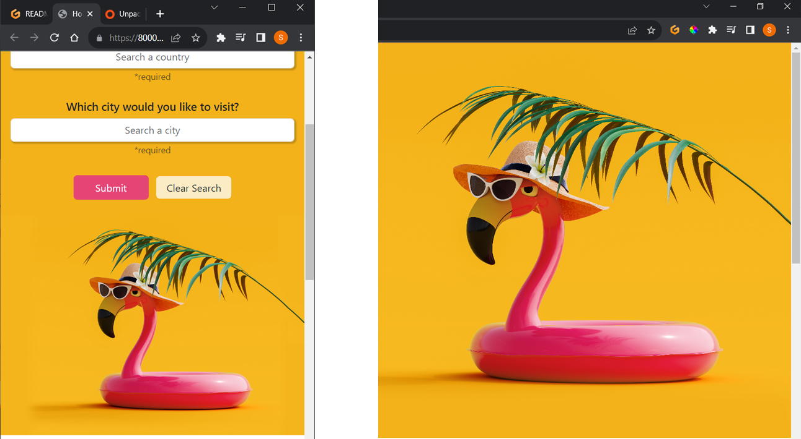

# HOLIDAY HOTSPOTS

Holiday Hotspots is a website where users can search for their next holiday destination and will display a range of hotels depending on which country and city chosen. It has a search form and a result section which displays the results of hotels based on the the information user inputs. Also, it displays information about recommended and popular holiday destinations and packages for the users that are still undecided on where they want to go.

The business goals for the site owner is to get users to choose a travel package from the site and/or from it's sponsors. The site is used to provide results in a manner that is visually appealing and user friendly so that the page doesn’t look overloaded with information but also clearly displays information on the holiday destinations. Why do we need a site for this? Well, with the internet being the most popular and preferred method of purchasing holidays nowadays we need to adapt to the digital way of displaying information to target our audience.

Who are the target audience? The site's target audience would be anyone of all ages planning a holiday and needing to search different destinations to help find what they are looking for. How was this achieved? This was achieved by having a search function for the user to interact with to search for their destination and reveal many results of 5* rated hotels. Also, when users visit the website they will be welcomed with the most popular destinations as suggestions/recommendations for ideas on somewhere different to go. Also, as this website is to target a wide audience the website is responsive to most devices from mobiles to computers which means it caters for all generations no matter what preferred device is used.

The value a website could bring is more customers for the site owner/sponsors and convenience for the users as many customers would rather use a website to search for their holidays now and this also reflected in the survey I did on Survey Monkey (link in sources) to analyze consumer opinions and behaviors and based on this research it is clear that most poeople would rather book holidays online than instore. Again, this is convenient for the users as you have all the packages supplied online in one place so you can view at home and not be inconvenienced by having to find a travel agent store.

;

https://ui.dev/amiresponsive?url=https://staceyjaynelewis.github.io/holiday-hotspots

## UX

Holiday Hotspots was created as a simple one page interactive website making it user-friendly and simple to use as it has a wide age range for target audience. The users are given a selection of hotels based on their choice of country and city chosen whilst interacting with the site. The website has been designed in a simple linear structure so that it can be easily developed further in the future and has the potential to add many more features to it without the site looking overcrowded. Its a simple journey to achieve what users are looking for with just 2 inputs to narrow their search and 1 submit button making it easy to use and not take too many clicks to get what they want and content hinting has been implemented in the design to show users can scroll down for more content. 

### Colour Scheme

For the design of the page my aim is to create a design that uses the colours associated with the background image throughout the site, allowing the website design to flow and be seen as one complete consistent theme. The main colours in the callout background image are orange(#E54575), black(#212529) and shades of pink(#f7b81f), which I think compliment each other very well, as the vibrant pink and orange work well in creating the warm summer feel, but are also eye-catching for the user.
The black and white opposite colours are then used to inform or guide the users to the information/features they are looking for such as search inputs, brand logo, headings but also to the information we want the user to be drawn to such as travel packages etc.
The reason I selected this image was mainly due to its modern style and colours which I think create a great reflection of holidays and as part of the survey I conducted with Survey Monkey (link provided in the source) one of the questions was a choice of 2 designs with one being the background I have used with the flamingo image. The majority of users picked this image and it was interesting to see that many of the older audience also picked this image and the reasons given were that the image is modern, fun and appealing due to its colours.

- `#212529` used for primary text.
- `#E54575` used for primary buttons and cards.
- `#f7b81f` used for background and footer.
- `#ffffff` used for logo, inputs and sections.

I used [coolors.co](https://coolors.co/212529-e54575-f7b81f-ffffff) to generate my colour palette.

### Typography

As you can see below I have chosen the fonts DM Serif, Poppins and Font awesome to use social media icons. When users have a page that contains a lot of text using icons can break up the page visually for the user and this is why I chose to use icons for the footer feature of the page rather than text. 
The DM Serif font is used for the logo and heading mainly as it is bold to make a statement and stand out but also has elegant serifs which represents the fun but sophisticated style we are looking to target the range of our audience' ages.
Poppins has been used for the informative text in the website with a simple style so that its readable and clear for the users. 

- [DM Serif](https://fonts.google.com/specimen/DM+Serif+Text?query=DM+) was used for the headers and logo.

- [Poppins](https://fonts.google.com/specimen/Poppins?query=poppins) was used for all other secondary text.

- [Font Awesome](https://fontawesome.com) icons were used throughout the site, such as the social media icons in the footer.

## User Stories

### New Site Users

- As a first time visitor, I want to easily understand how to get the results I want.
- As a first time visitor, I want to be able to easily navigate through the website, so I can find the content.
- As a first time visitor, I want to see a simple site that is clearly easily to use.
- As a first time visitor, I want to be able to see my chosen destination on a map. 

### Returning Site Users

- As a returning visitor, I want to be able to pick which hotel I like.
- As a returning visitor, I want to see information about the hotels, so that I can make a decision.
- As a returning visitor, I want to be able to find links to the companies social media or contact number so I can contact with  
  any questions I may have.
- As a returning visitor 

### Site Admin

- As a site administrator, I should be able to easily add new features to the website, so that I can renew content.
- As a site administrator, I should be able to see a well structured script with comments, so that I can easily identify each section in the script. 
- As a site administrator, I should be able to easily update the social media links and contact information, so that I can 

## Wireframes

To follow best practice, wireframes were developed for mobile, tablet, and desktop sizes.
I've used [Balsamiq](https://balsamiq.com/wireframes) to design my site wireframes.

### Website Wireframe

| Size | Screenshot |
| --- | --- |
| Mobile, Tablet, Desktop (from left to right) |  |

## Features

### Existing Features

- **Logo & search bar/form**

    - For the logo as mentioned in the typography section I have chosen the DM Serif font for the logo because I wanted a simple bold text logo so it does not take the users attention away from the page too much but is also readable for all ages. The value the logo will bring is the representation of the company with the simple text with a touch of elegant serifs to represent the luxury in the holidays.
    - The form is integral to the site as it allows the users to interact with it to achieve the results they are looking for which are the requested holiday packages that relates to their chosen city destination. The form is a simple format that has two inputs to firstly select their choice of country and then bring a pre populated list of the countries cities, making it user friendly as we bring the information to them depending on users choices. The form is also full reponsive so its compatible on most device sizes meaning it can be widely accessed. 

- **Background image**

    - The background image is for aesthetic to make the website look visually appealing and fun. When users are seaching for holidays they are usually excited and happy, so the background image used is bright, fun and colourful to match the users feelings when they visit. The value a good designed site can bring is a good impression and returning customers due to it's memorable design and so the effective use of colour and imagery is important on the callout.

- **Destination cards**

    - Simple cards designed to be easily readible and a simple button which can load more cards with more hotel results or guide users back to the top of the page to consider user experience and usability.

    <!-- place screenshot of cards here once done -->

- **Map & footer**

    - The value and purpose of the footer holds the links to any social media pages or contact information which can increase following on social media or direct users easily contact information if they have any queries. I have used the orange/yellow colour from the callout page background image on the footer so the colour scheme carries through the website but it works very well as it gives a highlighted effect making it noticeable for users.

### Future Features

- Add a refine option #1
    - Give more options to the customers of defining what they are looking for e.g attractions, museums, restaurants etc. Maybe this could just be simply another dropdown with the options. 
- Testimonials #2
    - Add customer reviews option on the cards so that users can see first hand reviews of the generated hotels.
- Contact Page #3
    - A contact page would be useful so we can include an email option to email us with any queries to make the site for user friendly as they will not have to leave our site to go to an external sites such a gmail if they want to email us with a query. This also gives customers another simple contact method as not all users like to call for information.

## Tools & Technologies Used

- [HTML](https://en.wikipedia.org/wiki/HTML) used for the main site content.
- [CSS](https://en.wikipedia.org/wiki/CSS) used for the main site design and layout.
- [CSS Flexbox](https://www.w3schools.com/css/css3_flexbox.asp) used for an enhanced responsive layout.
- [JavaScript](https://www.javascript.com) used for user interaction on the site.
- [Python](https://www.python.org) used as part of the gitpod connection to server.
- [Git](https://git-scm.com) used for version control. (`git add`, `git commit`, `git push`)
- [GitHub](https://github.com) used for secure online code storage.
- [GitHub Pages](https://pages.github.com) used for hosting the deployed front-end site.
- [Gitpod](https://gitpod.io) used as a cloud-based IDE for development.
- [Bootstrap](https://getbootstrap.com) used as the front-end CSS framework for modern responsiveness and pre-built components.
- [Miro](https://miro.com) used to help create flow charts for the read me.
- [TinyPNG](https://tinypng.com) used as tool for image compression.
- [geonames](http://www.geonames.org/) used for one of the api's used to get the country and city data.
- [amadeus](https://amadeus.com/en/topic/api) used for the api to get search results information on hotels.

## Testing

For all testing, please refer to the [TESTING.md](TESTING.md) file.

## Deployment

The site was deployed to GitHub Pages. The steps to deploy are as follows:
- In the [GitHub repository](https://github.com/staceyJayneLewis/holiday-hotspots), navigate to the Settings tab 
- From the source section drop-down menu, select the **Main** Branch, then click "Save".
- The page will be automatically refreshed with a detailed ribbon display to indicate the successful deployment.

The live link can be found [here](https://staceyjaynelewis.github.io/holiday-hotspots)

### Local Deployment

This project can be cloned or forked in order to make a local copy on your own system.

#### Cloning

You can clone the repository by following these steps:

1. Go to the [GitHub repository](https://github.com/staceyJayneLewis/holiday-hotspots) 
2. Locate the Code button above the list of files and click it 
3. Select if you prefer to clone using HTTPS, SSH, or GitHub CLI and click the copy button to copy the URL to your clipboard
4. Open Git Bash or Terminal
5. Change the current working directory to the one where you want the cloned directory
6. In your IDE Terminal, type the following command to clone my repository:
	- `git clone https://github.com/staceyJayneLewis/holiday-hotspots.git`
7. Press Enter to create your local clone.

Alternatively, if using Gitpod, you can click below to create your own workspace using this repository.

Please note that in order to directly open the project in Gitpod, you need to have the browser extension installed.
A tutorial on how to do that can be found [here](https://www.gitpod.io/docs/configure/user-settings/browser-extension).

#### Forking

By forking the GitHub Repository, we make a copy of the original repository on our GitHub account to view and/or make changes without affecting the original owner's repository.
You can fork this repository by using the following steps:

1. Log in to GitHub and locate the [GitHub Repository](https://github.com/staceyJayneLewis/holiday-hotspots)
2. At the top of the Repository (not top of page) just above the "Settings" Button on the menu, locate the "Fork" Button.
3. Once clicked, you should now have a copy of the original repository in your own GitHub account!

### Local VS Deployment

<!-- Use this space to discuss any differences between the local version you've developed, and the live deployment site on GitHub Pages. -->

## Credits

### Content

| Source | Location | Notes |
| --- | --- | --- |
| [Markdown Builder](https://traveltimn.github.io/markdown-builder) | README and TESTING | tool to help generate the Markdown files |
| [WP travel engine](https://wptravelengine.com/must-have-features-for-travel-websites/#Our_Top_5_Features_For_Travel_Agency_Websites) | research on user strategy | "Must have features on a travel website" |
| [Rapid Tables](https://www.rapidtables.com/web/color/white-color.html) | btn | Used to remind me how I can add opacity to the button using rgba |
| [Bootstrap](https://getbootstrap.com/documentation)
| [geonames](http://www.geonames.org/) | Search Input | used to get the country and city data.
| [amadeus](https://amadeus.com/en/topic/api) | card results | used for the api to get search results information on hotels |

### Media

| Source | Location | Type | Notes |
| --- | --- | --- | --- |
| [iStock](https://www.istockphoto.com/) | entire site | image | main background image |
| [googleMaps] (https://www.google.com/maps) | for map section | bottom section of the page |
<!-- images for the cards whichever source i use add here -->

### Acknowledgements

- I would like to thank my Code Institute mentor, [Juliia Konovalova](https://github.com/IuliiaKonovalova) for their support throughout the development of this project.
- I would like to thank the [Code Institute](https://codeinstitute.net) tutor team for their assistance with troubleshooting and debugging some project issues.
- I would like to thank the [Code Institute Slack community](https://code-institute-room.slack.com) for the moral support; it kept me going during periods of self doubt and imposter syndrome.
- I would like to thank my partner William, for believing in me, and allowing me to make this transition into software development and my daughter for being so patient in having less time with me due to sharing my time with doing this course.

