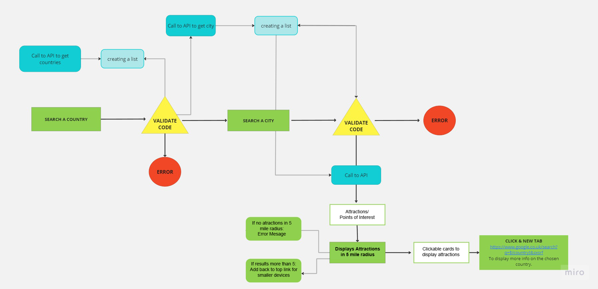
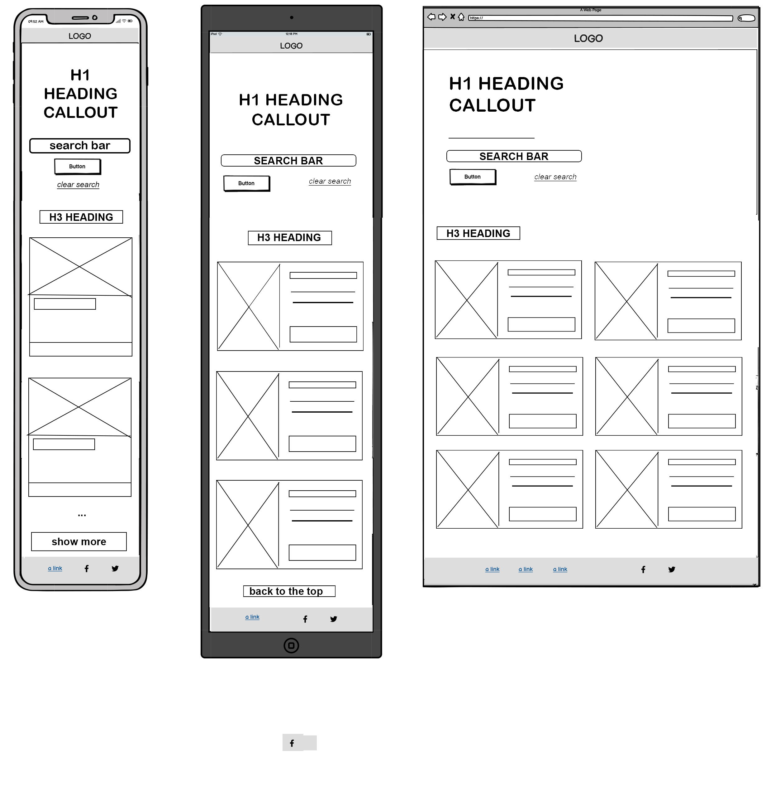
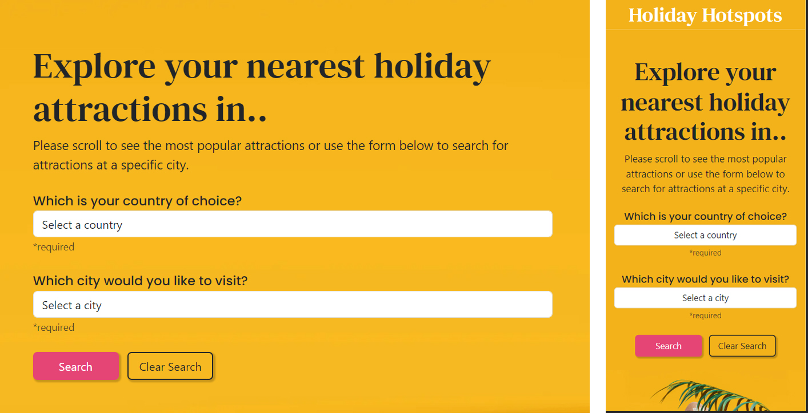
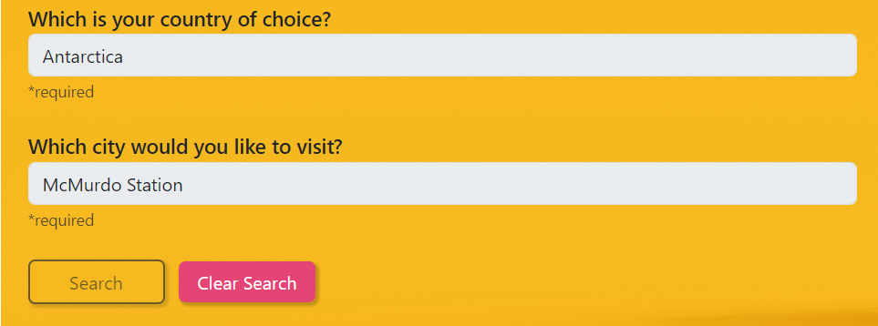
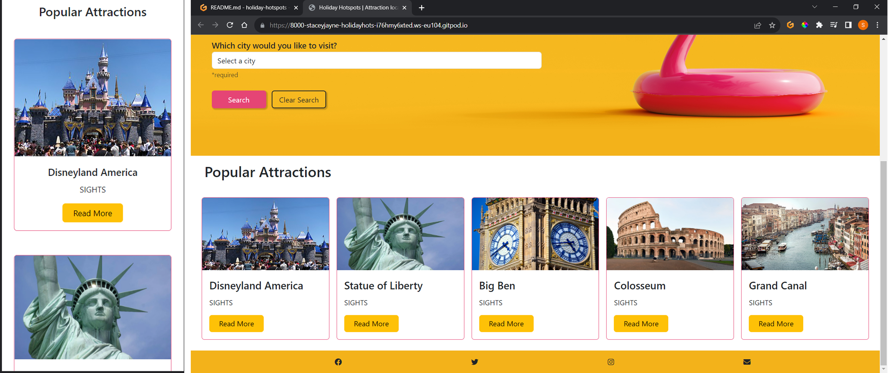
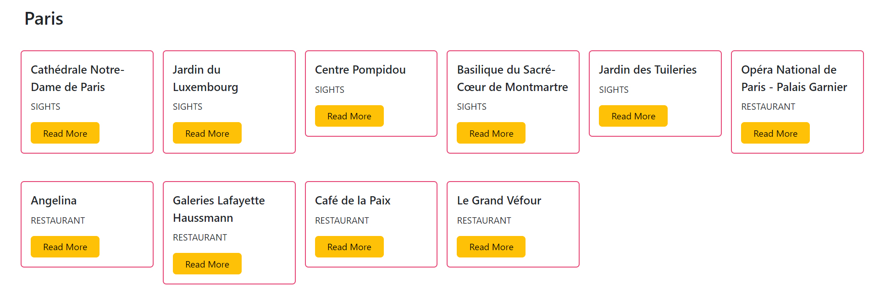
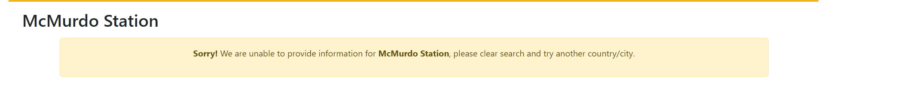
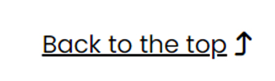
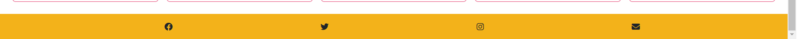

# HOLIDAY HOTSPOTS

### About
Holiday Hotspots is a website where users can search for attractions near their destination of choice, which is refined by country and city. It has a search form and a result section which displays attractions within 5 miles radius based on the country & city user selects. Also, if a user does not want to use the form as they are undecided, they can alternatively scroll to see recommended and popular attractions around the world which could help them make a decision.

Please note! As the API is a test API, it will only retrieve free data for the following Countries & Cities: 
Germany: Berlin
France: Paris
United Kingdom: London
United States: New York

(More data can be retrieved by paying for the Amadeus API - It was advised by my mentor that I do not need to pay for the API to get the data for every country, as it also shows using the API test data that the API is working). Also, I am aware that I am not to display the API secret key if it was a real world project/job. 

IMPORTANT NOTE! During this project my amaedus API was revoked, they sent me an email to say they were revoking due to it being publicly searchable on github. The github repository that they used in the email is NOT my github and after speaking with my mentor it was agreed it looks like someone else used my API key which caused this issue. I have since generated a new key and obfuscated the key in my best attempt to avoid this happening again. It was advised by my mentor to make note of this one here to explain the situation that occured. I have also noted this in unfixed bugs with the screenshot of the email that was sent to me.

### Business goals
The business goals for the site owner are to increase online presence meaning more online traffic, brand awareness and commission from advertising which could lead to opportunities such as partnering or being sponsored with travel agencies so user. The site is used to provide results in a manner that is visually appealing and user-friendly so that the page doesn’t look overloaded with information but also clearly displays information on a variety of attractions. Why do we need a site for this? Well, with the internet being the most popular and preferred method of searchings for short breaks/holidays nowadays we need to adapt to the digital way of displaying information to target our audience.

### Target Audience
Who are the target audience? The site's target audience would be anyone of all ages that are travelling, on holiday already, or even looking for a short sightseeing break idea. How was this achieved? This was achieved by having a search function for the user to interact with to choose their destination and reveal results of nearest attractions. Also, when users visit the website, they can expect to see the most popular attractions in different countries as suggestions on different attractions to visit. Additionally, as this website is to target a wide audience the website is responsive to most devices from mobiles to computers which means it caters for all generations no matter what preferred device is used.

The value a website could bring is convenience for the users as many customers would rather use a website to search for events/attractions now and this also reflected in the survey I did on Survey Monkey (https://www.surveymonkey.com/r/VYM2FCZ) to analyse consumer opinions and behaviours and based on this research it is clear that most people would rather research online than in a travel agency store. Again, this is convenient for the users as you have all the attractions on one site that will guide you to a relevant page with more information on that attraction when clicked.

The link for the deployed website is: https://staceyjaynelewis.github.io/holiday-hotspots/

https://ui.dev/amiresponsive?url=https://staceyjaynelewis.github.io/holiday-hotspots

## UX

Holiday Hotspots was created as a simple one-page interactive website, making it user-friendly and simple to use as it has a wide age range of target audience. The website has been designed in a simple linear structure so that it can be easily developed further in the future and has the potential to add many more features to it without the site looking overcrowded. It's a simple journey to achieve what users are looking for with just 2 inputs to narrow their search and 1 submit button making it easy to use and does not take too many clicks to get what they want, content hinting has also been implemented in the design to show users can scroll down for more content.

### Colour Scheme

For the design of the page, my aim is to create a design that uses the colours associated with the background image throughout the site, allowing the website design to flow and be seen as one complete consistent theme. The main colours in the callout background image are orange(#E54575), black(#212529) and shades of pink(#f7b81f), which I think compliment each other very well, as the vibrant pink and orange work well in creating the warm summer feel, but are also eye-catching for the user.
The black and white opposite colours are then used to inform or guide the users to the information/features they are looking for such as search inputs, brand logo, headings but also to the information we want the user to be drawn to such as popular attractions etc.
The reason I selected this image was mainly due to its modern quirky style and colours which I think create a great reflection of holidays and as part of the survey I conducted with Survey Monkey (https://www.surveymonkey.com/r/VYM2FCZ) one of the questions was a choice of 2 designs with one being the background I have used with the flamingo image. The majority of users picked this image, and it was interesting to see that many of the older audience also picked this image and the reasons given were that the image is modern, fun and appealing due to its colours.

- `#212529` used for primary text.
- `#E54575` used for primary buttons and cards.
- `#f7b81f` used for background and footer.
- `#ffffff` used for logo, inputs and sections.

I used [coolors.co](https://coolors.co/212529-e54575-f7b81f-ffffff) to generate my colour palette.

### Typography

As you can see below, I have chosen the fonts DM Serif, Poppins and Font awesome to use social media icons. When users have a page that contains a lot of text, using icons can break up the page visually for the user, and this is why I chose to use icons for the footer feature of the page rather than text. 
The DM Serif font is used for the logo and heading mainly as it is bold to make a statement and stand out but also has elegant serifs which represents the fun but sophisticated style we are looking to target in the range of our audience' ages.
Poppins has been used for the informative text in the website with a simple style so that it's readable and clear for the users.

- [DM Serif](https://fonts.google.com/specimen/DM+Serif+Text?query=DM+) is used for the headers and logo.

- [Poppins](https://fonts.google.com/specimen/Poppins?query=poppins) is used for all other secondary text.

- [Font Awesome](https://fontawesome.com) icons are used throughout the site, such as the social media icons in the footer.

## User Stories

### New Site Users

- As a first time visitor, I want to easily understand how to get the results I want.
- As a first time visitor, I want to be able to easily navigate through the website, so I can find the content.
- As a first time visitor, I want to see a simple site that is clearly easily to use.
- As a first time visitor, I want to be able to have different options to choose from when searching attractions.

### Returning Site Users

- As a returning visitor, I want to be able to pick which attraction I like.
- As a returning visitor, I want to see information about the attraction, so that I can make a decision.
- As a returning visitor, I want to be able to find links to the holiday hotspots' social media or email, so I can contact with any questions I may have.
- As a returning visitor, I want to be able to see popular attractions so if I change my mind and return, I am presented with suggestions. 

### Site Admin

- As a site administrator, I should be able to see a well-structured script with comments, so that I can easily identify each section in the script. 
- As a site administrator, I should be able to easily update the social media links and contact information, so that I can update it immediately for the users. 
- As a site administrator, I should be able to see each function labelled with multi-line comments so that I understand the purpose of each function.

## Wireframes

To follow best practice, wireframes were developed for mobile, tablet, and desktop sizes.
I've used [Balsamiq](https://balsamiq.com/wireframes) to design my site wireframes.

### Website Wireframe

| Size | Screenshot |
| --- | --- |
| Mobile, Tablet, Desktop (from left to right) |  |

## Features

### Existing Features

- **Logo & search bar/form #1**

    - For the logo as mentioned in the typography section, I have chosen the DM Serif font for the logo because I wanted a simple bold text logo, so it does not take the users' attention away from the page too much but is also readable for all ages. The value the logo will bring is the representation of the company with the simple text with a touch of elegant serifs to represent the luxury of the attractions.
    - The form is integral to the site, as it allows the users to interact with it to achieve the results they are looking for that relates to their chosen city destination. The form is a simple format that has two inputs to firstly select their choice of country and then bring a pre-populated list of the countries cities, making it user-friendly as we bring the information to them depending on users choices. The form is also fully responsive, so it's compatible on most device sizes, meaning it can be widely accessed. 

   - As you can see below, I have also added disabled functionality on the form so that users know they need to click 'clear search' if they want to change their search request for better user experience.

- **Background image #2**

    - The background image is for aesthetic to make the website look visually appealing and fun. When users are searching for places to visit they are usually excited and happy, so the background image used is bright, fun and colourful to match the users feelings when they visit. The value a good designed site can bring is a good impression and returning customers due to its memorable design, and so the effective use of colour and imagery is important on the callout.

- **Animated Arrow #3**

   - I have added an animated arrow which displays when the user makes a search to show users that they need to scroll to see their results, and the arrow also includes a link which takes them exactly to the section they need to view the search results when clicked too. The purpose is to make user experience easier especially for mobile users as if there are numerous results the user would have to scroll all the way back up to get to the top and search a different country/city.
   Also, the use of animation clearly shows users that it is clickable.

- **Destination cards #4**

    - Simple cards designed to display the most popular and recommended attractions displayed as default on the page when user first enters the site for any customers looking for new suggestions. Each card has a 'read more' button which holds a link to a page with more information on each attraction. 

- **Attraction Card Results #5**
    - Just like the destination cards I have used the same layout and design to display the returned API attractions results to keep the structure simple for easy navigation and usability for the user and also for the site admin. Keeping the simple card structure means no matter how many results are returned they will all show in neat columns and rows each with their own 'read more' link.

- **Error Banner #6**
    - I have added an error alert banner which displays if there are no results or the API does not hold the data for the chosen city/country. The purpose of this is to help users easily understand why no results have been returned and guides them on how to clear the form and try again. The alert is responsive and works on most devices so mobile users up large screen users will see this alert if alerted on results. 

- **Back to top #7**

    - The link is very useful for returning users back to the top of the site page especially for mobile users as if there are many results displayed users would have to scroll all the way back up to the top of the page if they wanted to return to the form to changed locations. I have added a hover pseudo class so that the user knows it is clearly clickable and is labeled by its functionality. The value this adds will be keeping users on the site page as they will not get frustrated and leave the site if they have numerous results to scroll through to go back up the page. 

- **Footer #8**

    - The value and purpose of the footer holds the links to any social media pages or contact information which can increase following on social media or direct users easily contact information if they have any queries. I have used the orange/yellow colour from the callout page background image on the footer so the colour scheme carries through the website but it works very well as it gives a highlighted effect making it noticeable for users.

### Future Features

- Add a refine option #1
    - Give more options to the customers of defining what they are looking for e.g museums, restaurants etc. Maybe this could just be simply another dropdown with the options. 
- Testimonials #2
    - Add customer reviews option on the cards so that users can see first hand reviews of the generated hotels.
- Contact Page #3
    - A contact page would be useful so we can include an email option to email us with any queries to make the site for user friendly as they will not have to leave our site to go to an external sites such a Gmail if they want to email us with a query. This also gives customers another simple contact method as not all users like to call for information.
- Map #4
    - Add a map which locates the city that is selected so user can see the location visually and where the attractions are around the city.
- Add another API #5
    - Add another API that will allow you to get images based on the attractions shown. The amadeus API only provides the data and does not provide the images of the attractions. I think it will help the user make their decision.

## Tools & Technologies Used

- [HTML](https://en.wikipedia.org/wiki/HTML) used for the main site content.
- [CSS](https://en.wikipedia.org/wiki/CSS) used for the main site design and layout.
- [CSS Flexbox](https://www.w3schools.com/css/css3_flexbox.asp) used for an enhanced responsive layout.
- [JavaScript](https://www.javascript.com) used for user interaction on the site.
- [Python](https://www.python.org) used as part of the gitpod connection to server.
- [Git](https://git-scm.com) used for version control. (`git add`, `git commit`, `git push`)
- [GitHub](https://github.com) used for secure online code storage.
- [GitHub Pages](https://pages.github.com) used for hosting the deployed front-end site.
- [Gitpod](https://gitpod.io) used as a cloud-based IDE for development.
- [Bootstrap](https://getbootstrap.com) used as the front-end CSS framework for modern responsiveness and pre-built components.
- [Miro](https://miro.com) used to help create flow charts for the read me.
- [TinyPNG](https://tinypng.com) used as tool for image compression.
- [geonames](http://www.geonames.org/) used for one of the api's used to get the country and city data.
- [amadeus](https://amadeus.com/en/topic/api) used for the api to get search results information on hotels.
- [am i responsive](https://ui.dev/amiresponsive) used to check if website is responsive and for mockup.
- [surveyMonkey](https://www.surveymonkey.com/r/VYM2FCZ) used to conduct a survey for consumer behaviours
- [obfuscator](https://obfuscator.io/) used to obfuscate api key.

## Testing

For all testing, please refer to the [TESTING.md](TESTING.md) file.

## Deployment

The site was deployed to GitHub Pages. The steps to deploy are as follows:
- In the [GitHub repository](https://github.com/staceyJayneLewis/holiday-hotspots), navigate to the Settings tab 
- From the source section drop-down menu, select the **Main** Branch, then click "Save".
- The page will be automatically refreshed with a detailed ribbon display to indicate the successful deployment.

The live link can be found [here](https://staceyjaynelewis.github.io/holiday-hotspots)

### Local Deployment

This project can be cloned or forked in order to make a local copy on your own system.

#### Cloning

You can clone the repository by following these steps:

1. Go to the [GitHub repository](https://github.com/staceyJayneLewis/holiday-hotspots) 
2. Locate the Code button above the list of files and click it 
3. Select if you prefer to clone using HTTPS, SSH, or GitHub CLI and click the copy button to copy the URL to your clipboard
4. Open Git Bash or Terminal
5. Change the current working directory to the one where you want the cloned directory
6. In your IDE Terminal, type the following command to clone my repository:
	- `git clone https://github.com/staceyJayneLewis/holiday-hotspots.git`
7. Press Enter to create your local clone.

Alternatively, if using Gitpod, you can click below to create your own workspace using this repository.

Please note that in order to directly open the project in Gitpod, you need to have the browser extension installed.
A tutorial on how to do that can be found [here](https://www.gitpod.io/docs/configure/user-settings/browser-extension).

#### Forking

By forking the GitHub Repository, we make a copy of the original repository on our GitHub account to view and/or make changes without affecting the original owner's repository.
You can fork this repository by using the following steps:

1. Log in to GitHub and locate the [GitHub Repository](https://github.com/staceyJayneLewis/holiday-hotspots)
2. At the top of the Repository (not top of page) just above the "Settings" Button on the menu, locate the "Fork" Button.
3. Once clicked, you should now have a copy of the original repository in your own GitHub account!

### Local VS Deployment

There are currently no differences with the local vs deployed website that I noticed on day of submission, as you can see in the screen recording below this was how it was submitted. 

## Credits

### Content

| Source | Location | Notes |
| --- | --- | --- |
| [Markdown Builder](https://traveltimn.github.io/markdown-builder) | README and TESTING | tool to help generate the Markdown files |
| [WP travel engine](https://wptravelengine.com/must-have-features-for-travel-websites/#Our_Top_5_Features_For_Travel_Agency_Websites) | research on user strategy | "Must have features on a travel website" |
| [Rapid Tables](https://www.rapidtables.com/web/color/white-color.html) | btn | used to remind me how I can add opacity to the button using rgba |
| [Bootstrap](https://getbootstrap.com/documentation) | used to check how to add alerts and card outlines |
| [geonames](http://www.geonames.org/) | Search Input | used to get the country and city data. |
| [amadeus](https://amadeus.com/en/topic/api) | card results | used for the API to get search results information on hotels |
| [w3 schools](https://www.w3schools.com/jsref/prop_element_classlist.asp) | clear search button | used to remove and add bg colour of clear search button |
| [freecodecamp](https://www.freecodecamp.org/news/css-vertical-align-how-to-center-a-div-text-or-an-image-example-code/) | form | used to help center align the form in the callout section |

### Media

| Source | Location | Type | Notes |
| --- | --- | --- | --- |
| [iStock](https://www.istockphoto.com/) | entire site | image | main background image |
| [wikipedia](https://www.nerdwallet.com/assets/blog/wp-content/uploads/2023/05/01-LR_0912-HDR-scaled-1-1920x1152.jpg) | Disneyland America card image | destination results section underneath callout |
| [wikipedia](https://cdn.britannica.com/82/183382-050-D832EC3A/Detail-head-crown-Statue-of-Liberty-New.jpg) | Statue of Liberty card image | destination results section underneath callout |
| [wikipedia](https://upload.wikimedia.org/wikipedia/commons/thumb/c/cc/The_Great_Clock_following_restoration_-_May_2022_(52120750076).png/1280px-The_Great_Clock_following_restoration_-_May_2022_(52120750076).png) | Big Ben card image | destination results section underneath callout |
| [wikipedia](https://upload.wikimedia.org/wikipedia/commons/thumb/d/de/Colosseo_2020.jpg/1280px-Colosseo_2020.jpg) | Colosseom card images | destination results section underneath callout |
| [wikipedia](https://upload.wikimedia.org/wikipedia/commons/thumb/5/51/View_of_the_Grand_Canal_from_Rialto_to_Ca'Foscari.jpg/1920px-View_of_the_Grand_Canal_from_Rialto_to_Ca'Foscari.jpg) | Grand Canal card image | destination results section underneath callout |
| [wikipedia](https://upload.wikimedia.org/wikipedia/commons/thumb/a/a0/Sydney_Australia._(21339175489).jpg/1920px-Sydney_Australia._(21339175489).jpg) | Sydney Opera House card image | destination results section underneath callout |

### Acknowledgements

- I would like to thank my Code Institute mentor, [Juliia Konovalova](https://github.com/IuliiaKonovalova) for their support throughout the development of this project. Juliia went above and beyond to help me learn API's for the first time and I now feel more confident using them.
I would like to thank Tim Nelson mentor, for the markdown template which helped form the structure of the read me and tesing.
- I would like to thank the [Code Institute](https://codeinstitute.net) tutor team for their assistance with troubleshooting and debugging some project issues.
- I would like to thank the [Code Institute Slack community](https://code-institute-room.slack.com) for the moral support; it kept me going during periods of self doubt and imposter syndrome.
- I would like to thank my partner William, for believing in me, and allowing me to make this transition into software development and my daughter for being so patient in having less time with me due to sharing my time with doing this course.

