# Testing

Return back to the [README.md](README.md) file.

## Code Validation

### HTML

I have used the recommended [HTML W3C Validator](https://validator.w3.org) to validate all of my HTML files.

| Page | W3C URL | Screenshot | Notes |
| --- | --- | --- | --- |
| Home | [W3C](https://validator.w3.org/nu/?doc=https%3A%2F%2Fstaceyjaynelewis.github.io%2Fholiday-hotspots%2F) | 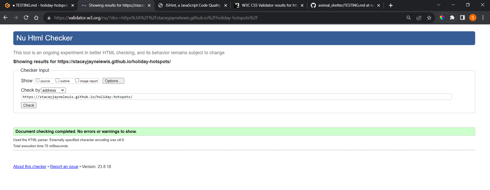 | Pass: No errors or warnings to show |

### CSS

I have used the recommended [CSS Jigsaw Validator](https://jigsaw.w3.org/css-validator) to validate all of my CSS files.

| File | Jigsaw URL | Screenshot | Notes |
| --- | --- | --- | --- |
| style.css | [Jigsaw](https://jigsaw.w3.org/css-validator/validator?uri=https%3A%2F%2Fstaceyjaynelewis.github.io%2Fholiday-hotspots%2F&profile=css3svg&usermedium=all&warning=1&vextwarning=&lang=en) | 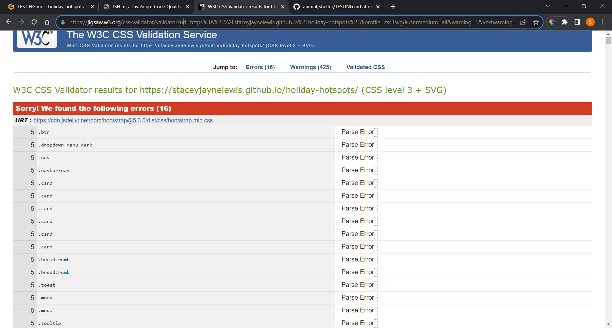 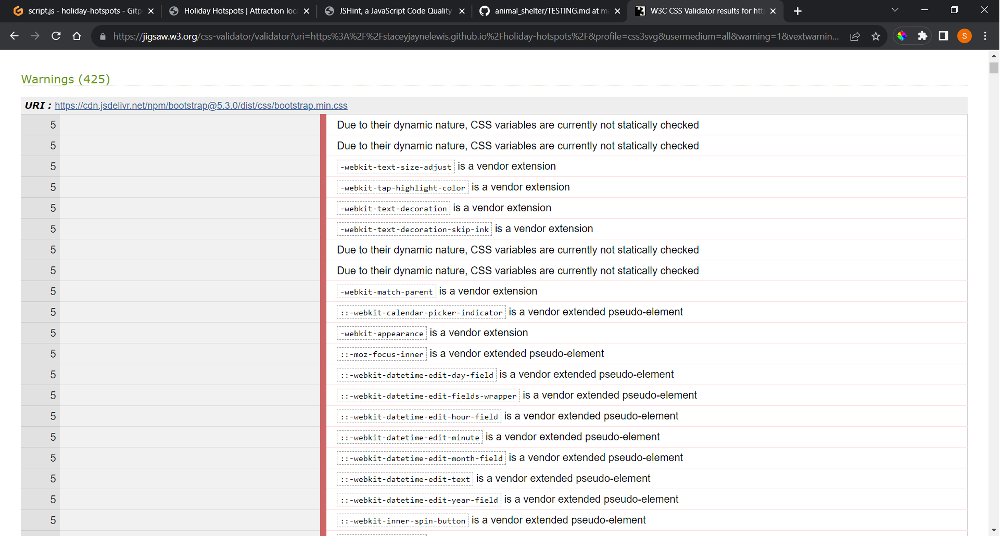 | Pass: No Errors - many warnings of the bootstrap built in components but no error or warnings on my own code |

### JavaScript

I have used the recommended [JShint Validator](https://jshint.com) to validate all of my JS files.

| File | Screenshot | Notes |
| --- | --- | --- |
| script.js | 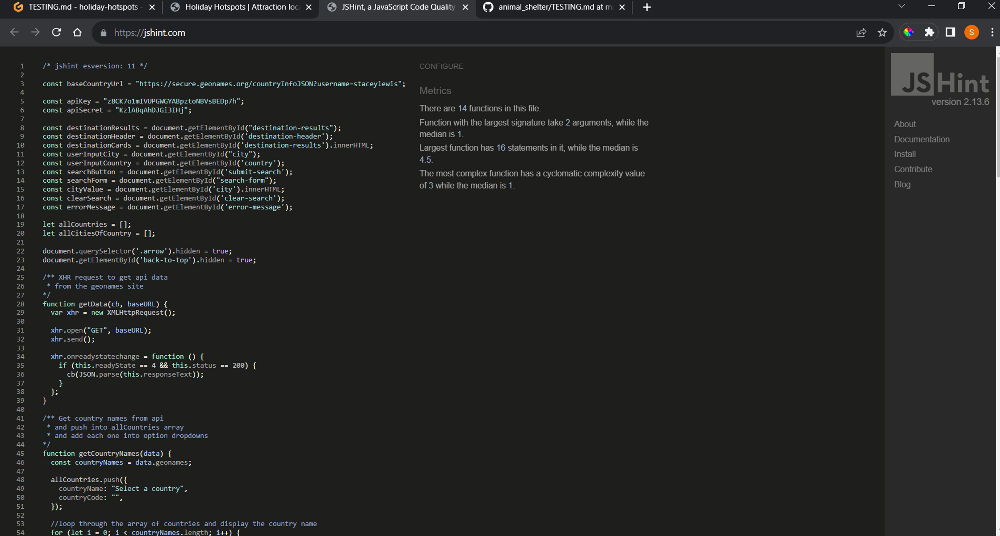 | Pass: no errors |

## Browser Compatibility

I've tested my deployed project on multiple browsers to check for compatibility issues.

| Browser | Screenshot | Notes |
| --- | --- | --- |
| Chrome | 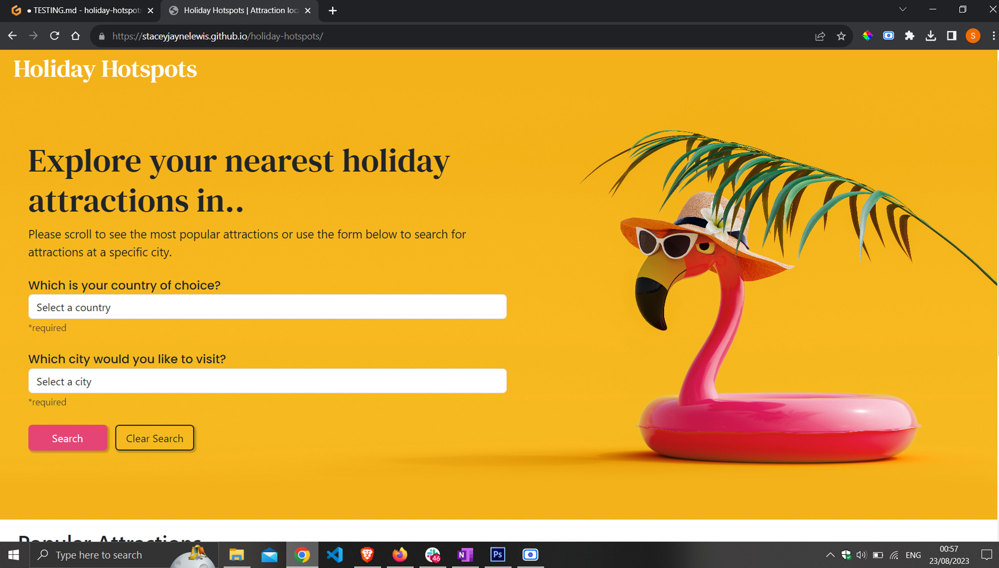 | Works as expected |
| Firefox | 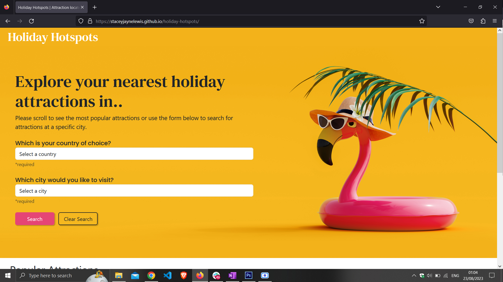 | Works as expected |
| Brave | 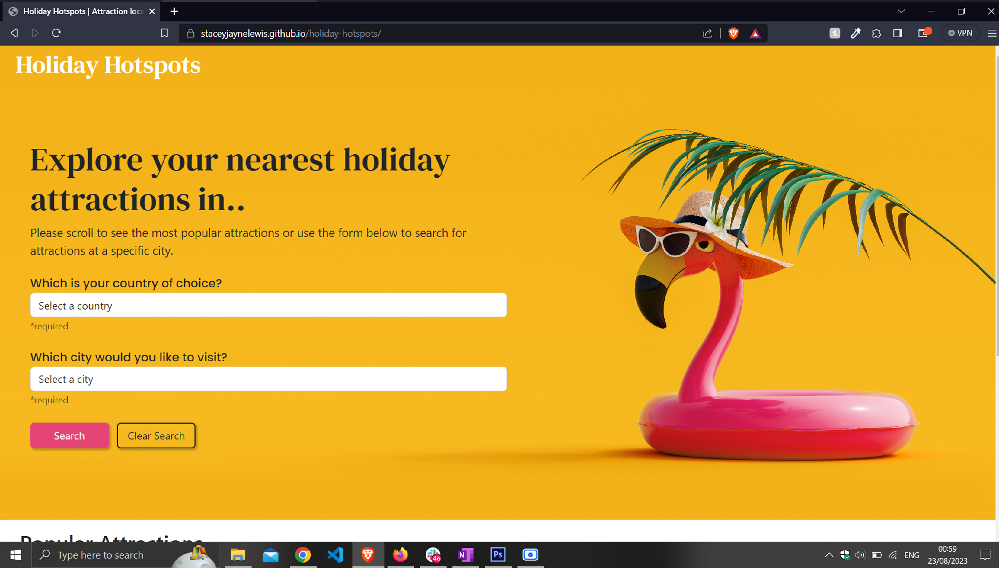 | Works as expected |

## Responsiveness

I've tested my deployed project on multiple devices to check for responsiveness issues.

| Device | Screenshot | Notes |
| --- | --- | --- |
| Mobile (DevTools - built in mobile Samsung8+) |  | Works as expected |
| Mobile (DevTools version2) | .gif) | Works as expected |
| Tablet (DevTools) |  | Works as expected |
| Tablet (DevTools - built in ipadAir & ipadMini) |  | Works as expected |
| Desktop |  | Works as expected |
| Google Pixel 7 |  | Works as expected |

## Lighthouse Audit

I've tested my deployed project using the Lighthouse Audit tool to check for any major issues.

| Page | Size | Screenshot | Notes |
| --- | --- | --- | --- |
| Home | Mobile | 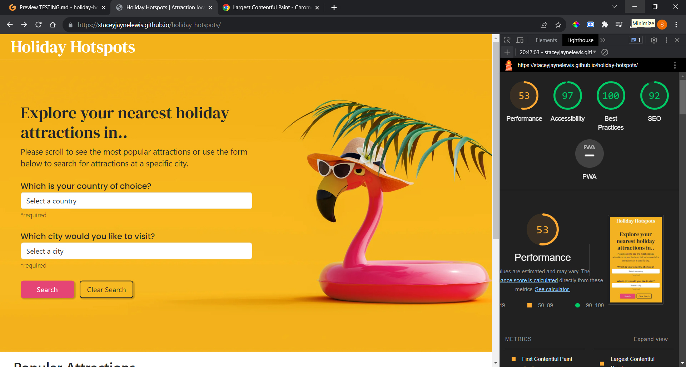 | Some minor warnings |
| Home | Desktop | 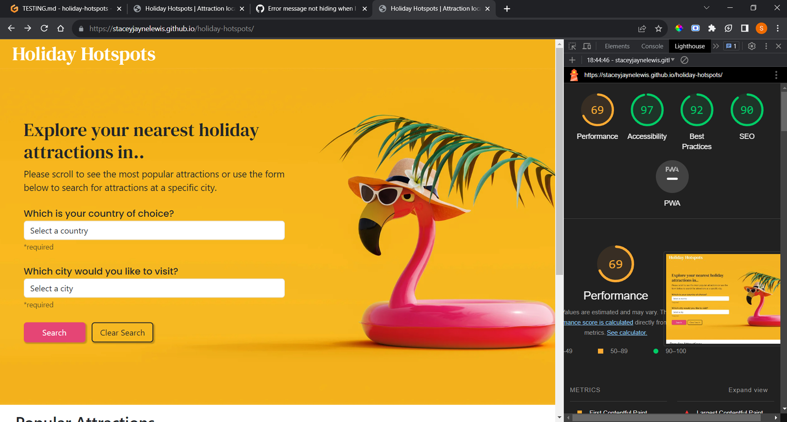 | Some minor warnings |

## Defensive Programming

Defensive programming was manually tested with the below user acceptance testing:

| Page | User Action | Expected Result | Pass/Fail | Comments |
| --- | --- | --- | --- | --- |
| Callout | | | | |
| | Country Input | Dropdown appears with list of countries when clicked | Pass | |
| | Country Input | Displays tool tip that says 'Please select an item in a list' if search clicked but no country selected from the dropdown | Pass | |
| | City Input | Dropdown appears with list of cities when clicked | Pass | |
| | City Input | When a country is selected city input automatically displays first city in list  | Pass | |
| | Search button | disables when clicked until 'clear search' is clicked | Pass | |
| | Search button | if both inputs are valid displays search results of attractions in selected city when clicked in destinations section | Pass | |
| | Search button | When clicked if no data for that city, display alert message in destination section of page | Pass | |
| | Clear Search Button | resets form inputs | Pass | |
| | Clear Search Button | clear search is disabled until search is clicked and higlights when search is clicked | Pass | |
| | Clear Search Button | clears search results and displays original recommended destination cards | Pass | |
| | Clear Search Button | if an alert is displayed - removes the alert once selected | Pass | |
| | Arrow Button | when clicked moves to the attraction results section of the page | Pass | |
| Destinations section | | | | |
| | Popular attraction cards | 'Read more' button opens new page with related information on that city e.g big ben, disneyland etc | Pass | |
| | Search results cards | cards 'read more' button opens new page with related information on that attraction, I tested the test data cities' attractions (paris, berlin, london, new york) | Pass | |
| | Search results cards | cards display in responsive columns and rows | Pass | |
| | Back to top link | Springs back to the top of the page when clicked | Pass | |
| Footer | | | | |
| | facebook icon link | on click opens a new page tab to facebook page | Pass | |
| | instagram icon link | on click opens a new page tab to instagram page | Pass | |
| | twitter icon link | on click opens a new page tab to twitter page | Pass | |
| | email icon link | on click opens a new page tab to gmail page | Pass | |


## User Story Testing

| User Story | Screenshot |
| --- | --- |

| As a first time visitor, I want to easily understand how to get the results I want. | 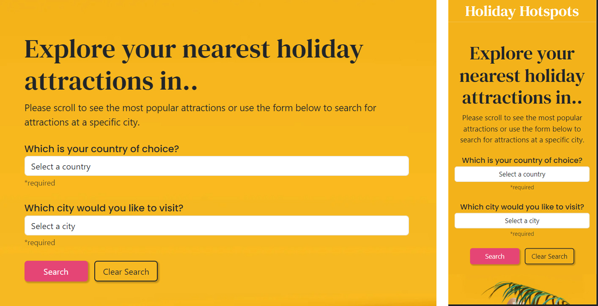|
| As a first time visitor, I want to be able to easily navigate through the website, so I can find the content. | 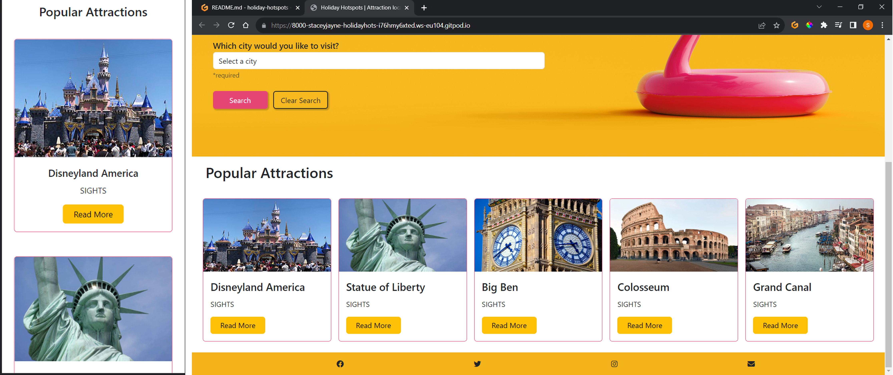 |
| As a first time visitor, I want to see a simple site that is clearly easily to use. |  |
| As a first time visitor, I want to be able to have different options to choose from when searching attractions. | 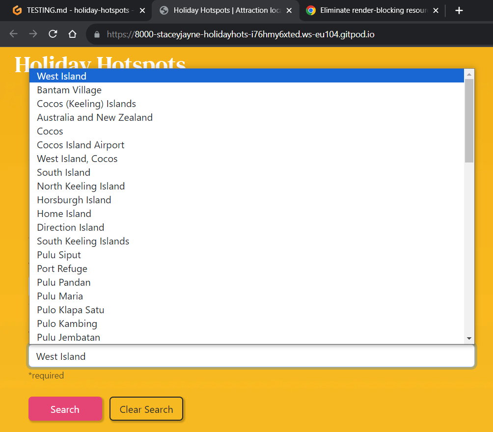 |
| As a returning visitor, I want to be able to pick which attraction I like. | 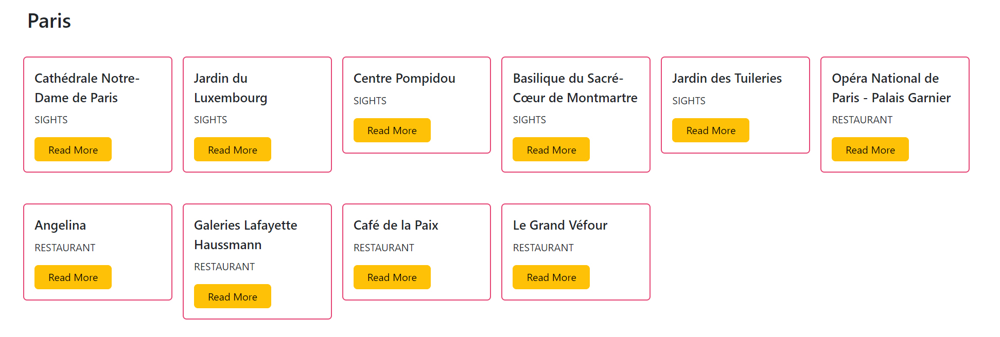 |
| As a returning visitor, I want to see information about the attraction, so that I can make a decision. |  |
| As a returning visitor, I want to be able to find links to the holiday hotspots' social media or email, so I can contact with any questions I may have. | 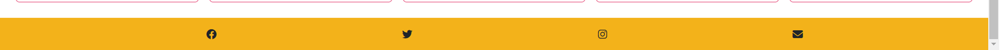 |
| As a returning visitor, I want to be able to see popular attractions so if I change my mind and return, I am presented with suggestions. |  |
| As a site administrator, I should be able to see a well-structured script with comments, so that I can easily identify each section in the script. | 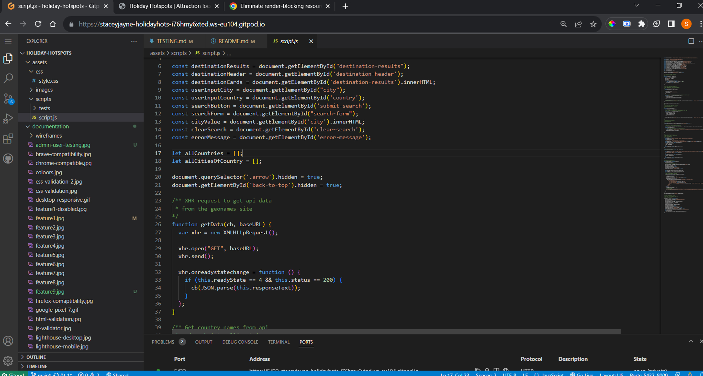 |
| As a site administrator, I should be able to easily update the social media links and contact information, so that I can update it immediately for the users. |  |
| As a site administrator, I should be able to see each function labelled with multi-line comments so that I understand the purpose of each function. | 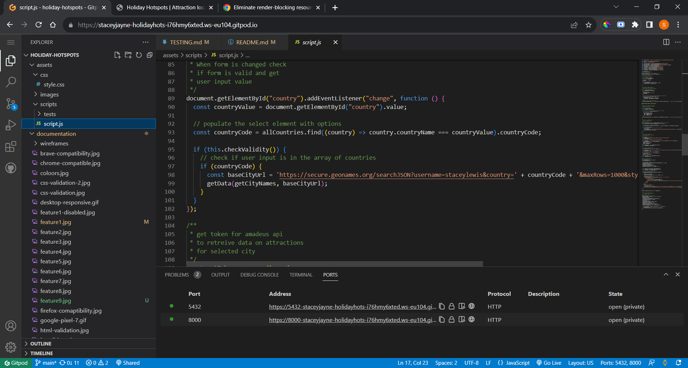 |
 
## Automated Testing

I have conducted a series of automated tests on my application.

I fully acknowledge and understand that, in a real-world scenario, an extensive set of additional tests would be more comprehensive.

### JavaScript (Jest Testing)

⚠️⚠️⚠️⚠️⚠️ START OF NOTES (to be deleted) ⚠️⚠️⚠️⚠️⚠️

Adjust the code below (file names, etc.) to match your own project files/folders.

🛑🛑🛑🛑🛑 END OF NOTES (to be deleted) 🛑🛑🛑🛑🛑

I have used the [Jest](https://jestjs.io) JavaScript testing framework to test the application functionality.

In order to work with Jest, I first had to initialize NPM.

- `npm init`
- Hit `enter` for all options, except for **test command:**, just type `jest`.

Add Jest to a list called **Dev Dependencies** in a dev environment:

- `npm install --save-dev jest`

**IMPORTANT**: Initial configurations

When creating test files, the name of the file needs to be `file-name.test.js` in order for Jest to properly work.

Due to a change in Jest's default configuration, you'll need to add the following code to the top of the `.test.js` file:

```js
/**
 * @jest-environment jsdom
 */

const { test, expect } = require("@jest/globals");
const { function1, function2, function3, etc. } = require("../script-name");

beforeAll(() => {
    let fs = require("fs");
    let fileContents = fs.readFileSync("index.html", "utf-8");
    document.open();
    document.write(fileContents);
    document.close();
});
```

Remember to adjust the `fs.readFileSync()` to the specific file you'd like you test.
The example above is testing the `index.html` file.

Finally, at the bottom of the script file where your primary scripts are written, include the following at the bottom of the file.
Make sure to include the name of all of your functions that are being tested in the `.test.js` file.

```js
if (typeof module !== "undefined") module.exports = {
    function1, function2, function3, etc.
};
```

Now that these steps have been undertaken, further tests can be written, and be expected to fail initially.
Write JS code that can get the tests to pass as part of the Red-Green refactor process.

Once ready, to run the tests, use this command:

- `npm test`

**NOTE**: To obtain a coverage report, use the following command:

- `npm test --coverage`

Below are the results from the tests that I've written for this application:

| Test Suites | Tests | Coverage | Screenshot |
| --- | --- | --- | --- |
| 1 passed | 16 passed | 55% |  |
| x | x | x | repeat for all remaining tests |

#### Jest Test Issues

⚠️⚠️⚠️⚠️⚠️ START OF NOTES (to be deleted) ⚠️⚠️⚠️⚠️⚠️

Use this section to list any known issues you ran into while writing your Jest tests.
Remember to include screenshots (where possible), and a solution to the issue (if known).

This can be used for both "fixed" and "unresolved" issues.

🛑🛑🛑🛑🛑 END OF NOTES (to be deleted) 🛑🛑🛑🛑🛑

## Bugs

- Background image displaying on the browser preview but on the live site it is not displaying

    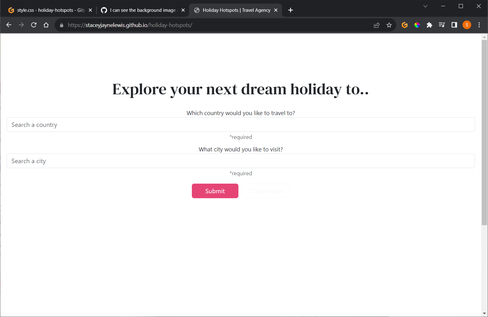

    - To fix this, I noticed I forgot to put the ../ at the start of the URL as I am currently in the CSS folder and need to go out of that folder to get back to the assets folder.
    

- Footer not visible as it hides behind the map element (note this bug was before I removed the map feature).

    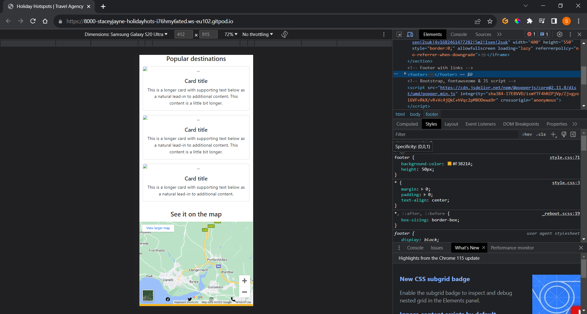

    - To fix this, I realised I added a width and height in the style.css page however there is already a set height and width which have been included in the iframe element and so this was confusing the code.

- Unable to retrieve the country name data from the API, its returning the whole array

    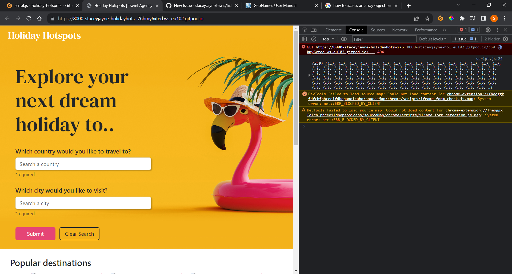

    - To fix this, I discovered that I could use a for loop to push the country names into an array and then I can use a for each loop to add into the option element for the dropdown.

- I want the default value of the dropdown option to display 'select a country' instead of the first country option in the list 

    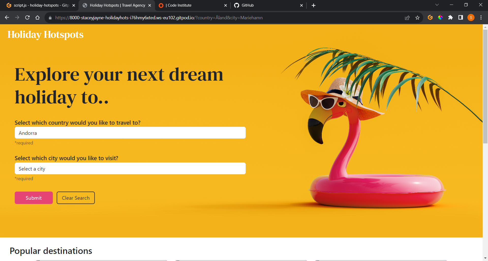

    - To fix this, a trial and error and some research I came to the conclusion that the easiest way to resolve this would be to use the same push method as used in the for loop but use another push method before the for loop with the values of what I want in.

- API list of country and cities works on the local site but not the live site

    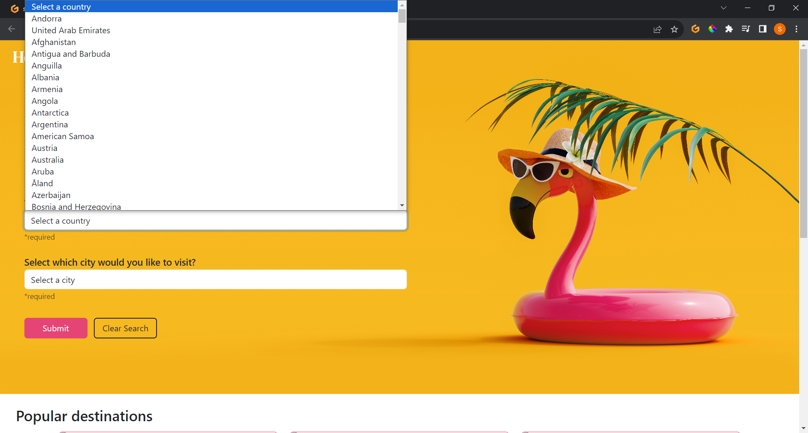
    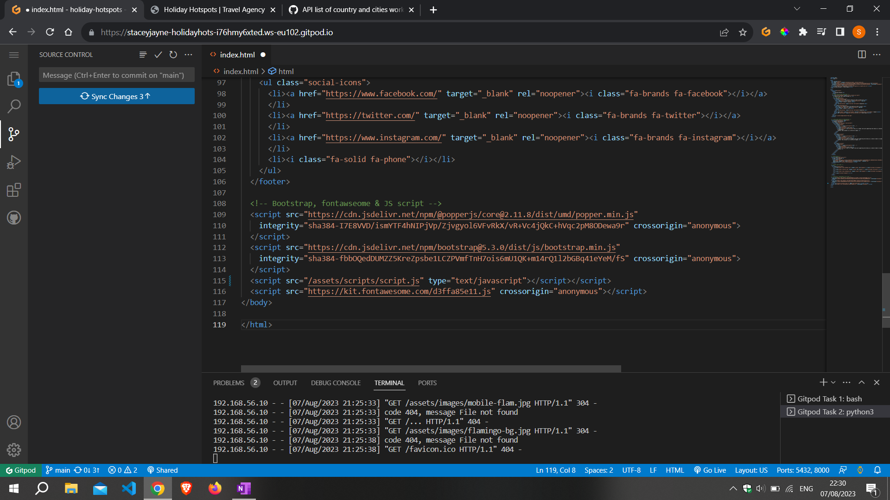

    - To fix this, I noticed after checking my paths that there was an extra end script tag and I also had a absolute file path for the js script file instead of a relative.

- Trying to get coordinates of selected city to the getCoordinates function

    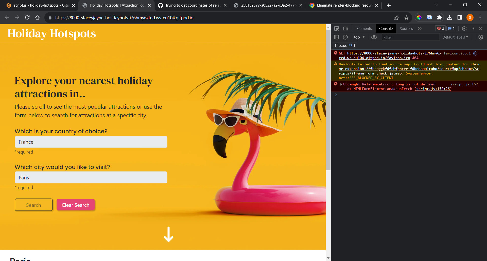

    - To fix this, I realised that I don't need the getCoordinates function as I used data-attributes on the city options to store the longitude and latitude values pushed to the array and fetch the values by using dataset.

- On submit the cards in the popular destinations section appear but then dissapear until submit is clicked again

    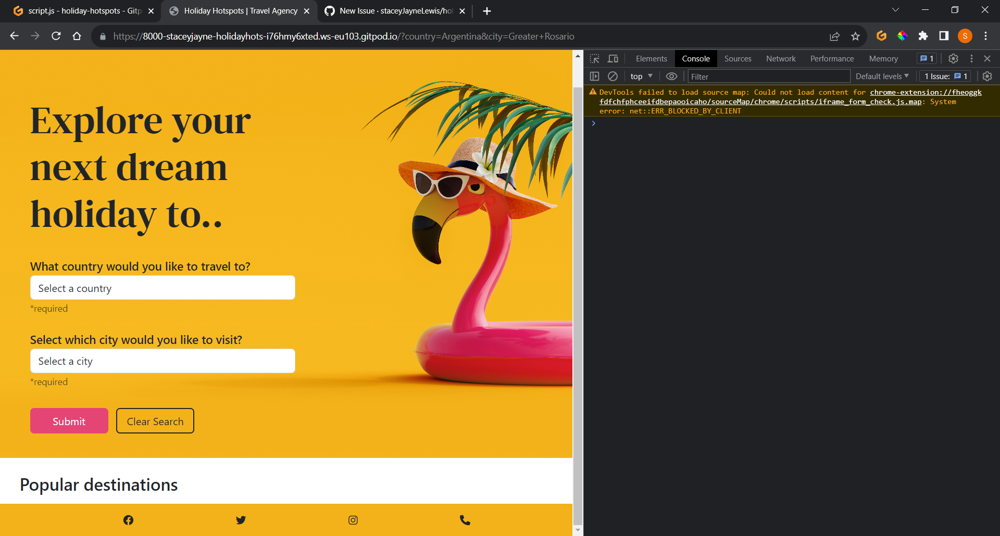

    - To fix this, after some research I realised I needed to add a prevent default on the form as when bootstrap forms submit a form, the default behaviour is to "POST" to the given url, if no url is given it will try to post to the some url the page is currently on. I also needed to update the element to an input with the type submit instead help the default behaviour.

- The amadeus api failed to fetch the data as it does not have ok HTTP data.

    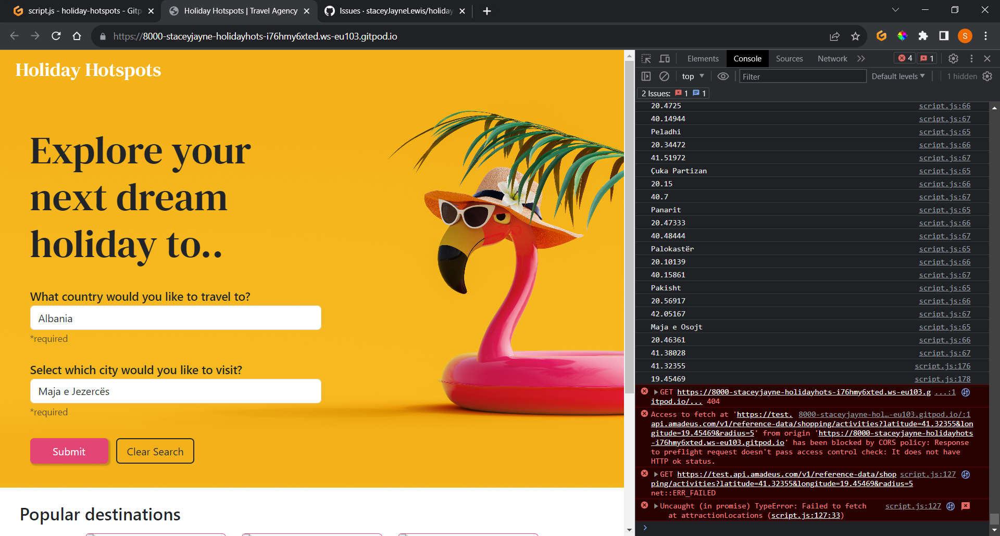

    - To fix this, I looked into the API documentation and realised that there were certain restrictions on the api link I was using to retrieve the locations. Alternatively I found a different link for points of interest that I can use instead where I can make up to 400 call requests for free. You will see in this screenshot below that I changed the amadeus API link to another suggested link which say's 'poi' for points of interest which seems to work well for the free cities data provided with the test API.

- Getting the value of the original Dom innerHTML in the dom tree after manipulation

    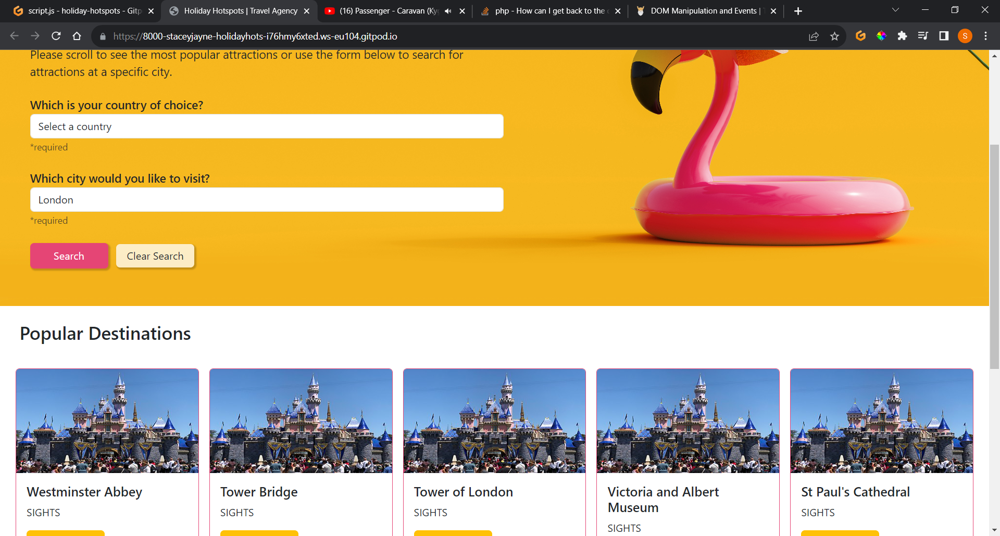
    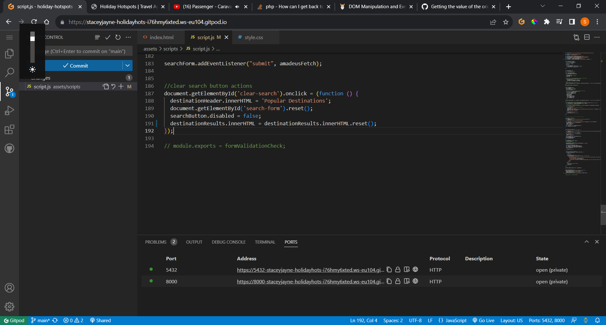

    - To fix this, after researching the easiest method to do this, what worked for me is simply storing the element's inner HTML in a const variable so that I can refer back to that variable whenever I need the results on the page to return back to its original state. I stored the destination cards in the destinationCards variable so I can then get those particular cards to display again when user selects clear search so user does not have to use the 'refresh' on the browser itself each time they want to search a different country or city.

- Error message not hiding when I click the clear search button

    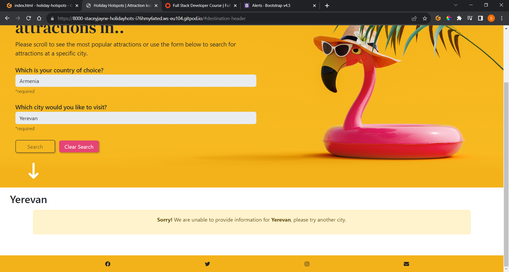
    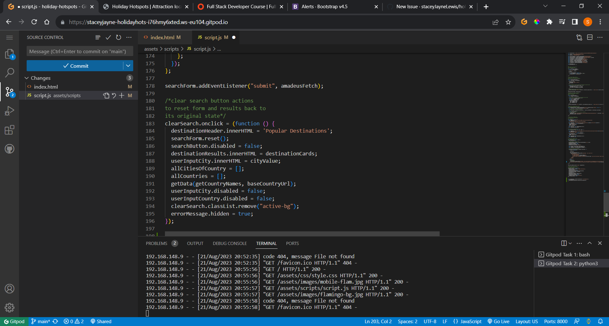

    - To fix this, as the method remove() did not work for me, instead I targetted the parentNode and removed the child node (which is the alert message) , rather than putting the expression in the parenthesis I stored the expression in a variable and put it in the removeChild() method. Lastly, I needed to wrap the code in an if statement as without this the code still would not work but as we contain the code in the if statement when the statement is true it will function it.

- JS `'let'` or `'const'` or `'template literal syntax'` or `'arrow function syntax (=>)'` is available in ES6 (use `'esversion: 11'`) or Mozilla JS extensions (use moz).

    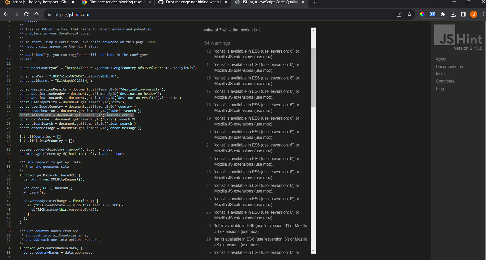

    - To fix this, I included  /* jshint esversion: 11 */ on the top of the jsHint programme so jsHint validator recognizes the modern ES6 methods.

### GitHub **Issues**

I have used github issues to manage my bugs and keep a tracker of the problem and how I solved them for the above bug noted above in the bug's section.

**Fixed Bugs**

All previously closed/fixed bugs can be tracked [here](https://github.com/staceyJayneLewis/holiday-hotspots/issues?q=is%3Aissue+is%3Aclosed).

| Bug | Status |
| --- | --- |
| [I can see the background image on the browser preview but on the live site it is not displaying](https://github.com/staceyJayneLewis/holiday-hotspots/issues/1) | Closed |
| [Footer not visible as it hides behind the map element](https://github.com/staceyJayneLewis/holiday-hotspots/issues/2) | Closed |
| [Unable to retrieve the country name data from the API, its returning the whole array](https://github.com/staceyJayneLewis/holiday-hotspots/issues/3) | Closed |
| [I want the default value of the dropdown option to display 'select a country' instead of the first country option in the list](https://github.com/staceyJayneLewis/holiday-hotspots/issues/4) | Closed |
| [API list of country and cities works on the local site but not the live site](https://github.com/staceyJayneLewis/holiday-hotspots/issues/5) | Closed |
| [Trying to get coordinates of selected city to the get coordinates function](https://github.com/staceyJayneLewis/holiday-hotspots/issues/6) | Closed |
| [On submit the cards in the popular destinations section appear but then dissapear until submit is clicked again](https://github.com/staceyJayneLewis/holiday-hotspots/issues/7) | Closed |
| [The amadeus api failed to fetch the data as it does not have ok HTTP data.](https://github.com/staceyJayneLewis/holiday-hotspots/issues/8) | Closed |
| [Getting the value of the original Dom innerHTML in the dom tree after manipulation](https://github.com/staceyJayneLewis/holiday-hotspots/issues/9) | Closed |
| [Error message not hiding when I click the clear search button](https://github.com/staceyJayneLewis/holiday-hotspots/issues/) | Closed |

**Open Issues**

There are currently no open issues in github.

## Unfixed Bugs

- When validating with CSS jigsaw validator it was showing 16 error that are from the bootstrap CDN. 

    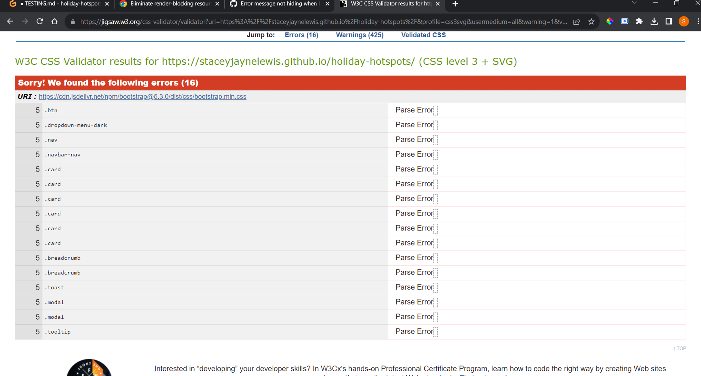

    - Attempted fix: this was expected as I have used bootstrap CDN and the validator does not recognise this so it will attempt to validate the bootstrap code and throw this error. Theres nothing I can do to fix this. 

- When using the amadeus api it does not retrieve the all of the data for all cities. If the city is not in the test api data it will throw the error in the screenshot below.
    
    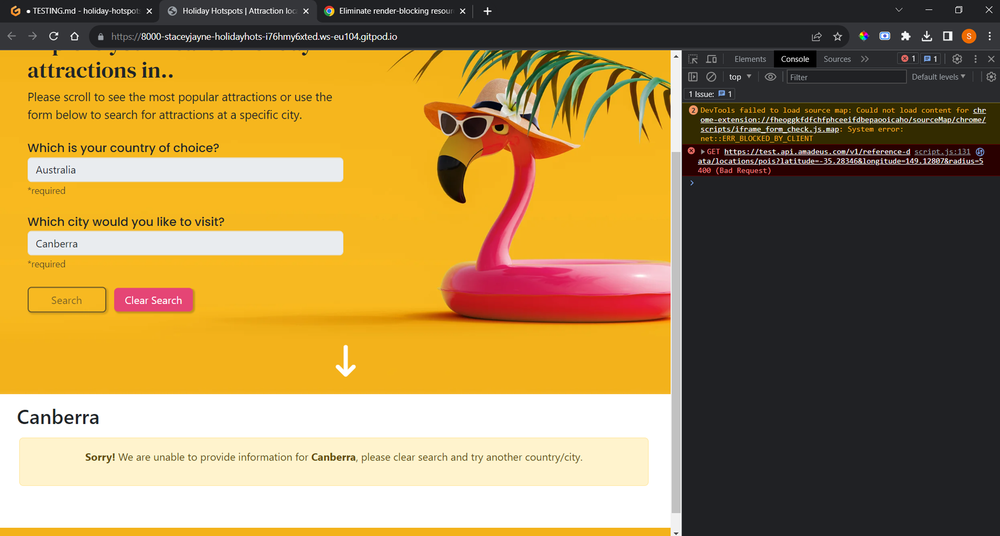

    - Attempted Fix: I could fix this by purchasing the api for more data, however advised by mentor no need to purchase more data as the api test data for the four cities is suffice. 
